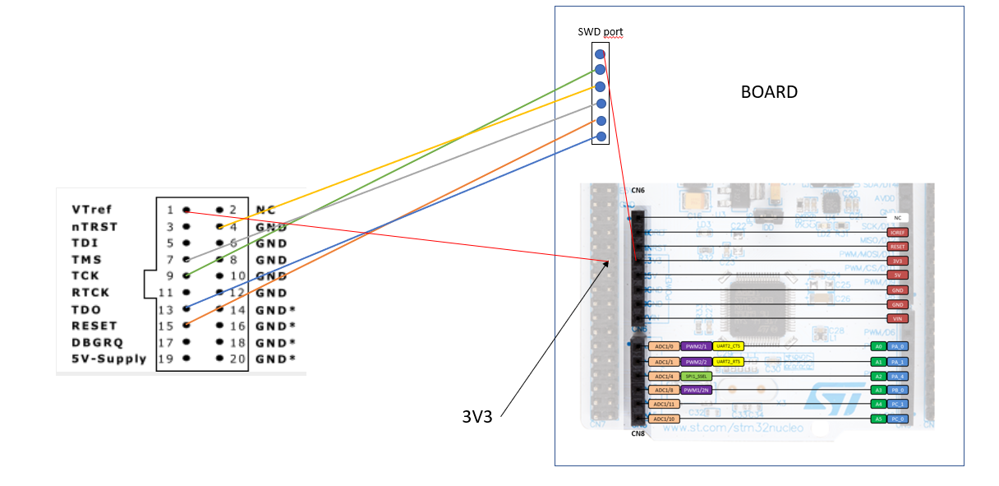
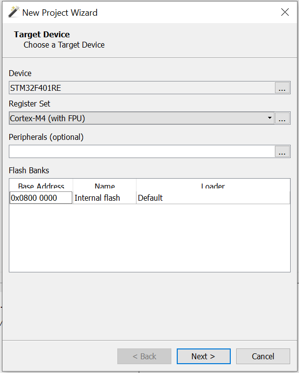
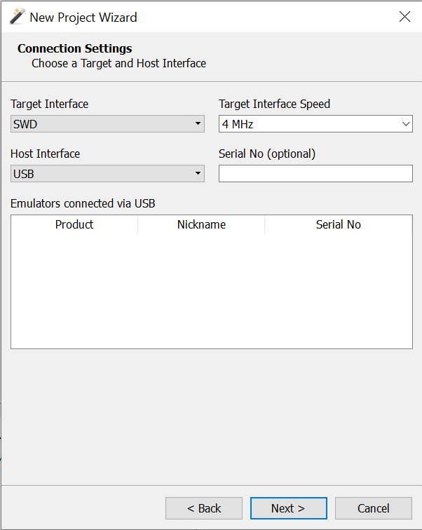
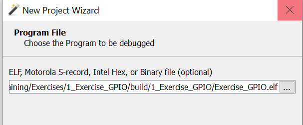
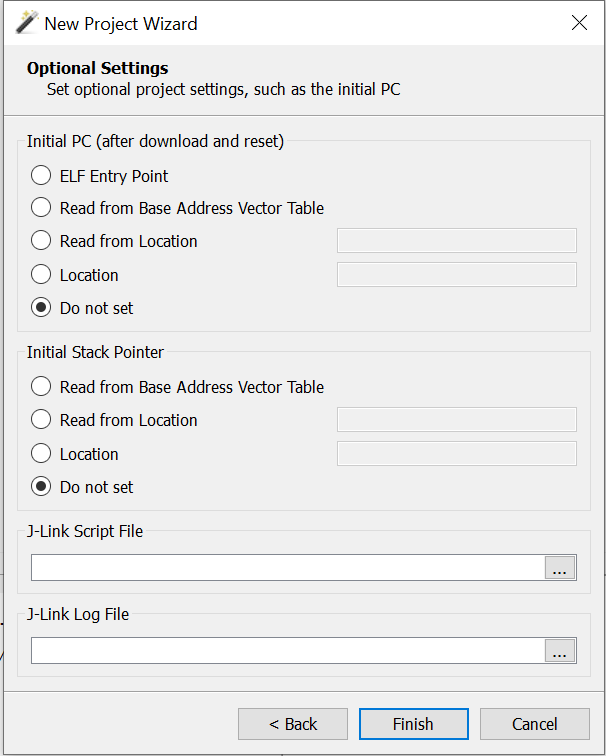
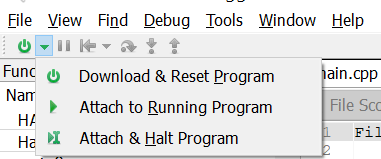

# Flash and debug the board with Ozone

During this training you will need to flash programms on the board and (maybe) debug your code.
To achieve that we will use the software Ozone and a j-link.
Ozone is a free Software that allow the user to flash code and read the memory while the code is running. It is a useful tool to work with.  

## Connection with the j-link

First we have to connect the j-link to the board. For that we will use the SWD port of the board. You can look at the following pictures for the connection :  

If you need more information you can look at [this link](https://mcuoneclipse.com/2015/08/22/debugging-stm32f103rb-nucleo-board-with-with-segger-j-link/).  

## How to use Ozone

### Install Ozone

To install Ozone download the installer [here](https://www.segger.com/downloads/jlink/#Ozone) and execute it.  
Then you can follow the installation steps.  

### Flash and debug with Ozone

Launch Ozone and create a new project.  
Select `STM32F401RE` as device and `Cortex-M4` as register set.  

The target interface will be SWD and Host interface will be USB

Select the executable

And for the other settings select `Do not set`

Now your project is ready.  
You can press the button `Download and reset programm` on the top-left  

The programm is now flashed on the board.  
You have access to all the tools of Ozone to debug such as the memory or the console.  